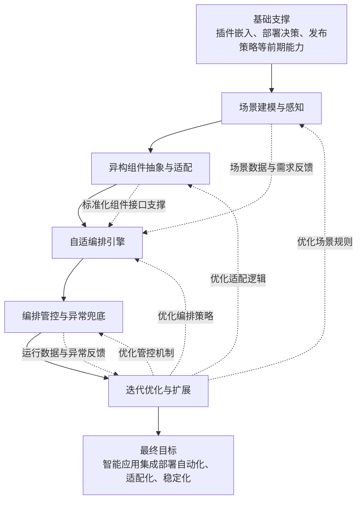

```mermaid
flowchart TD
    A[基础支撑<br/>插件嵌入、部署决策、发布策略等前期能力] --> B[场景建模与感知]
    B --> C[异构组件抽象与适配]
    C --> D[自适编排引擎]
    D --> E[编排管控与异常兜底]
    E --> F[迭代优化与扩展]
    F --> G[最终目标<br/>智能应用集成部署自动化、适配化、稳定化]

    B -. 场景数据与需求反馈 .-> D
    C -. 标准化组件接口支撑 .-> D
    E -. 运行数据与异常反馈 .-> F
    F -. 优化场景规则 .-> B
    F -. 优化适配逻辑 .-> C
    F -. 优化编排策略 .-> D
    F -. 优化管控机制 .-> E
```